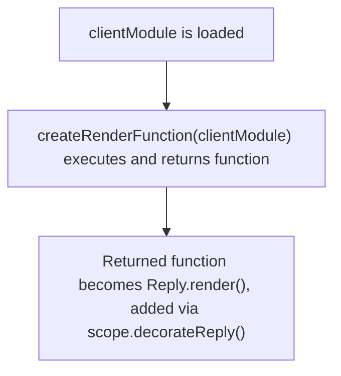
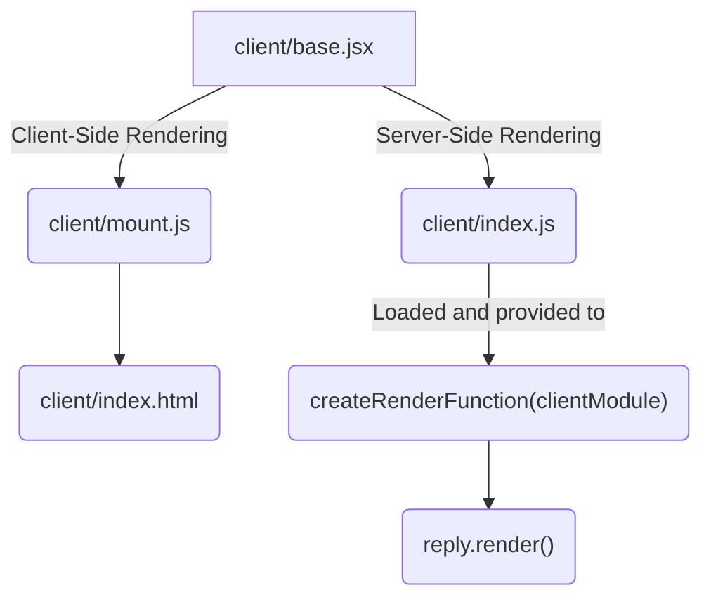

[ssr-1]: https://hire.jonasgalvez.com.br/2022/apr/30/a-gentle-introduction-to-ssr/

# Rendering Function

If you're looking to perform [Server-Side Rendering (SSR)][ssr-1], or simply want to automatically register additional API routes based on your client appication routes, among many other potential scenarios, you'll need to provide your Fastify server instance with access to your client application.

For example, if you're looking to perform SSR on a React application, you'll need access to your main React component on the server so you can use [`renderToString()`](https://react.dev/reference/react-dom/server/renderToString) (or [`renderToPipeableStream()`](https://react.dev/reference/react-dom/server/renderToPipeableStream) in an ideal scenario).

The way to accomplish this is by providing a [`createRenderFunction()`](http://localhost:5173/config/createRenderFunction) hook to your **@fastify/vite** plugin options. It will receive as the first parameter a reference to your **Vite application module**, i.e., your client application. The function returned by it will be added ([decorated](https://fastify.dev/docs/v2.15.x/Documentation/Decorators/)) to the `Reply` class as `render()` in your Fastify plugin scope.




**`@fastify/vite`** treats your Vite project root as a JavaScript module, so it'll automatically look for `index.js` as the **server entry point**, that is, the module that's gets [bundled for production](https://vitejs.dev/guide/ssr.html#building-for-production) in [**SSR mode**](https://vitejs.dev/config/build-options.html#build-ssr) by Vite.

This is what **Vite application module** or **client module** refers to. You can change this behavior (looking for `index.js`) via the [`clientModule`](/config/clientModule) configuration option, which lets you specify a custom module path for `@fastify/vite` to load. 

> Having `client/index.js` though is a simple, straighforward convention that requires no additional configuration.

## Vanilla example

The best way to really grasp `createRenderFunction()` is by exploring an example.
Consider the project layout from the [`react-vanilla`](https://github.com/fastify/fastify-vite/tree/dev/examples/react-vanilla) example:

```text
├── client/
│    ├── base.jsx
│    ├── index.html
│    ├── index.js
│    └── mount.js
├── package.json
├── server.js
└── vite.config.js
```

> Test configuration files from the example were omitted for brevity.

The React component to be server-side rendered is in `client/base.jsx`. **It's vital to understand here** that the same code needs to be available for both CSR and SSR. Unless you're delivering pages with static markup (no JavaScript), SSR just means the client code runs on the server first where markup is pre-rendered for the client, but the client still needs all the code to perform CSR as usual, i.e., it needs to run your client application code.

The only difference is that it won't have to **re-render** **pre-rendered** markup sent by the server. That's where the client hydration APIs for each framework come into place. Vue has `createSSRApp()`, React has `hydrateRoot()` and every other framework that supports SSR has equivalent methods.

- For CSR (Client-Side Rendering): 
  - `client/base.jsx` is imported by `client/mount.js`.
  - `client/mount.js` is imported by `client/index.html`.
 
- For SSR (Server-Side Rendering):
  `client/mount.js`
  - which is loaded by `@fastify/vite`
  - and provided to `createRenderFunction()`



::: info
If you're new to the mechanics of SSR, client hydration can be confusing. 

The Vue 3 SSR documentation has a **concise explanation**:

> _To make the client-side app interactive, Vue needs to perform the hydration step. During hydration, it creates the same Vue application that was run on the server, matches each component to the DOM nodes it should control, and attaches DOM event listeners._

:::

::: code-group
```jsx [client/base.jsx]
import React from 'react'

export function createApp () {
  return (
    <p>Hello world from React and @fastify/vite!</p>
  )
}
```
```js [client/mount.js]
import { hydrateRoot } from 'react-dom/client'
import { createApp } from './base.jsx'

const mountElement = document.querySelector('main')

// hydrateRoot() avoids re-rendering prerendered markup
hydrateRoot(mountElement, createApp())
```
```html [client/index.html]
<!DOCTYPE html>
<main><!-- element --></main>
<script type="module" src="/mount.js"></script>
```
```js [client/index.js]
import { createApp } from './base.jsx'

// Provides function needed to perform SSR
export default { createApp }
```
:::

## Routing integration

**`@fastify/vite`** automatically [decorates](https://www.fastify.io/docs/latest/Reference/Decorators/) the Fastify [Reply](https://www.fastify.io/docs/latest/Reference/Reply/) class with two additional methods, `reply.render()` and `reply.html()`. 

This section explores how to define `reply.render()`.

> Tto learn about `reply.html()` check out [Templating Function](/guide/templating-function).


Next we have the **client entry point**, which is the code that **mounts** the React instance to the **server-side rendered HTML element**. It is aptly named `client/mount.js`:

```js
import { hydrateRoot } from 'react-dom/client'
import { createApp } from './base.jsx'

hydrateRoot(document.querySelector('main'), createApp())
```

> If we were to skip **server-side rendering** (also possible!) and go straight to client-side rendering, we'd use the [`createRoot()`](https://reactjs.org/docs/react-dom-client.html#createroot) function from `react-dom`, but in this case, since we expect React to find readily available markup delivered by the server, we use [`hydrateRoot()`](https://reactjs.org/docs/react-dom-client.html#hydrateroot).

Now, let's see `client/index.js`:

```js
import { createApp } from './base.jsx'

export default { createApp }
```

All it does is make the `createApp()` function available to the server-side code. In order to create `reply.render()`, **`@fastify/vite`** expects you to provide a `createRenderFunction()` function as a plugin option. This function receives as first parameter the default export from your client module (`client/index.js` above).

Now the following snippet, `server.js`, will be easy to follow:

```js
import Fastify from 'fastify'
import FastifyVite from '@fastify/vite'
import { renderToString } from 'react-dom/server'

const server = Fastify()

await server.register(FastifyVite, { 
  root: import.meta.url, 
  createRenderFunction ({ createApp }) {
    return () => {
      return {
        element: renderToString(createApp())
      }
    }
  }
})

await server.vite.ready()
await server.listen({ port: 3000 })
```

You can guess the `createApp` value collected from the first argument passed to `createRenderFunction()` is coming from `client/index.js`. It proceeds to use that to create a new instance of your app, in this case, the root React component, and pass it to `renderToString()` from `react-dom/server`.

A string with a the server-side renderered HTML fragment for your React component is produced by `renderToString()`, and then returned in an object as `element`. The only thing left to do in this example is manually specifying a route to call `reply.render()` from, but we also need to call `reply.html()`:

```js
server.get('/', (req, reply) => {
  reply.html(reply.render())
})
```

That's what's required to get a SSR function for your Vite-bundled application and send the generated markup through a route handler — but there's a big question left to answer: 

How does that HTML fragment end up in `index.html`? 
