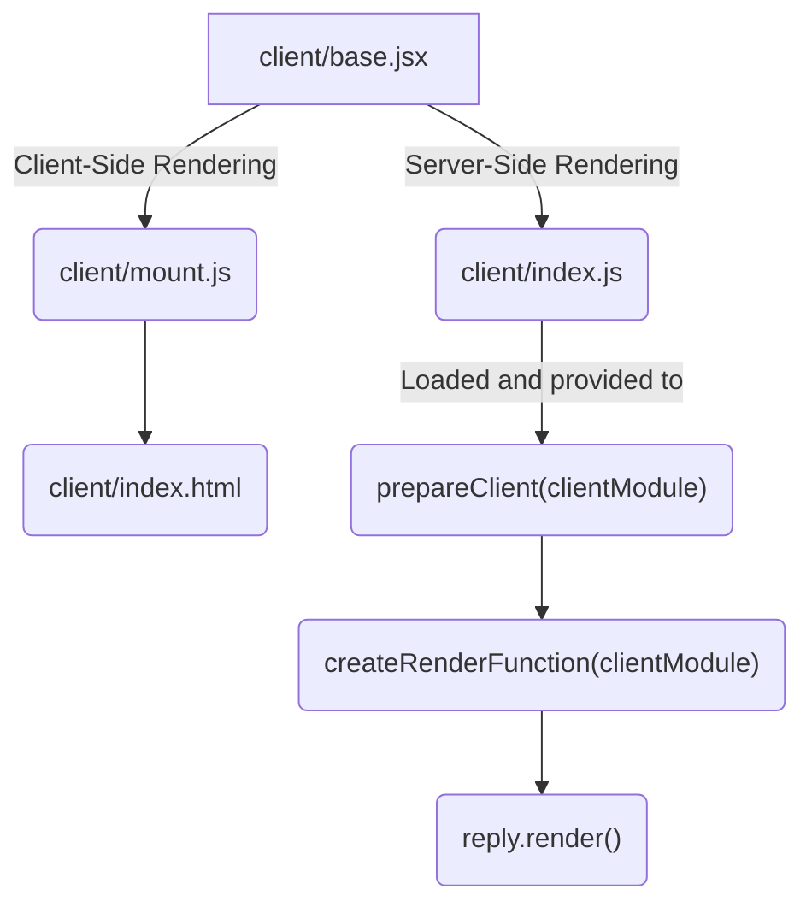

<!--@include: ./parts/links.md-->
<!--@include: ./parts/notice.md-->

# Rendering Function

If you're looking to perform [Server-Side Rendering (SSR)][ssr-1], or simply want to automatically register additional API routes based on your client application routes, among many other potential scenarios, you'll need to provide your Fastify server instance with access to your client application.

For example, if you're looking to perform SSR on a React application, you'll need access to your main React component on the server so you can use [`renderToString()`](https://react.dev/reference/react-dom/server/renderToString) (or [`renderToPipeableStream()`](https://react.dev/reference/react-dom/server/renderToPipeableStream) in an ideal scenario).

When **@fastify/vite** loads your client module, be it via [`ssrLoadModule()`](https://vitejs.dev/guide/ssr.html#building-for-production) in development mode or straight from the production bundle (this is controlled via the `dev` configuration option), it is passed to the `prepareClient()` and `createRenderFunction()` configuration hooks.

The default behavior of `prepareClient()` is to just load the module as-is, but also execute `routes` in case it's provided as a function (this is for routing integration, covered later in this section). `createRenderFunction()` **does not** have a default definition, **it needs to be provided**.

To illustrate, a snippet from the [`react-vanilla`][react-vanilla] SSR example:

```js {4-9}
await server.register(FastifyVite, {
  root: import.meta.dirname,
  createRenderFunction({ createApp }) {
    return () => {
      return {
        element: renderToString(createApp()),
      }
    }
  },
})
```

`createRenderFunction()` receives as the first parameter a reference to your **Vite application module**, i.e., your client application. The function it returns is added ([decorated](https://fastify.dev/docs/v2.15.x/Documentation/Decorators/)) to the Fastify `Reply` class as `render()`.

**`@fastify/vite`** treats your Vite project root as a JavaScript module, so it'll automatically look for `index.js` as the **server entry point**, that is, the module that's gets [bundled for production](https://vitejs.dev/guide/ssr.html#building-for-production) in [**SSR mode**](https://vitejs.dev/config/build-options.html#build-ssr) by Vite.

This is what **Vite application module** or **client module** refers to.

You can change this behavior (looking for `index.js`) via the [`clientModule`](/config/#clientmodule) configuration option, which lets you specify a custom module path for **`@fastify/vite`** to load. Having `client/index.js` though is a simple, straighforward convention that requires no additional configuration.

The best way to really grasp `createRenderFunction()` is by exploring an example. Consider the project layout from the [`react-vanilla`][react-vanilla] example:

```text
├── client/
│    ├── base.jsx
│    ├── index.html
│    ├── index.js
│    └── mount.js
├── package.json
├── server.js
└── vite.config.js
```

> Test configuration files from the example were omitted for brevity.

Let's focus on the main React component:

::: code-group

```jsx [client/base.jsx]
import React from 'react'

export function createApp() {
  return <p>Hello world from React and** **`@fastify/vite`**!**</p>
}
```

:::

The React component to be server-side rendered is in `client/base.jsx`.

**The key thing to understand** when doing SSR is that **the same code** needs to be available for **both CSR and SSR**, that is to say, doing SSR without also delivering and running the code for CSR is just static rendering.

And unless you're delivering pages with static markup (no JavaScript), SSR just means the client code runs on the server first where markup is pre-rendered for the client, but the client **still needs all the code to perform CSR as usual**.

The only difference is that it won't have to **re-render** **pre-rendered** markup sent by the server. That's where the client hydration APIs for each framework come into play. Vue has `createSSRApp()`, React has `hydrateRoot()` and every other framework that supports SSR has equivalent methods.

::: info
The [Vue 3 SSR documentation](https://vuejs.org/guide/scaling-up/ssr.html) has a **concise explanation** that **applies to all other frameworks**:

> _To make the client-side app interactive, Vue needs to perform the hydration step. During hydration, it creates the same Vue application that was run on the server, matches each component to the DOM nodes it should control, and attaches DOM event listeners._
> :::

In the [react-vanilla][react-vanilla] example, both `client/mount.js` and `client/index.js` load `client/base.jsx`. The first is loaded by `client/index.html` and used for CSR and the latter is loaded by **`@fastify/vite`** and provided to the `prepareClient()` and `createRenderFunction()` hooks.

::: code-group

```html [client/index.html]
<!DOCTYPE html>
<div id="root"><!-- element --></div>
<script type="module" src="/mount.js"></script>
```

```js [client/mount.js]
import { hydrateRoot } from 'react-dom/client'
import { createApp } from './base.jsx'

const mountElement = document.getElementById('root')

// hydrateRoot() avoids re-rendering prerendered markup
hydrateRoot(mountElement, createApp())
```

```js [client/index.js]
import { createApp } from './base.jsx'

// Provides component needed to perform SSR
export default { createApp }
```

:::



So once you have `reply.render()` available, which returns `{ element }` as shown in the snippet below, you can call `reply.html()` to send your `index.html` template to the client with `<!-- element -->` replaced by your server-side rendered markup.

> This works because **`@fastify/vite`** turns your original Vite project's `index.html` file into a templating function, where each segment enclosed in HTML comments becomes a variable. That's configurable via the `createHtmlTemplatingFunction()` and `createHtmlFunction()` configuration options. They are covered in detail in the [**Templating Function**](/guide/templating-function) documentation section.

You can pass an object to `reply.html()` with the variables to replace. If you don't, it will implicitly pass `reply.render()` to it.

That is to say, `reply.html()` is the same as `reply.html(reply.render())`.
::: code-group

```js {6-11,16} [server.js]
const server = Fastify()

await server.register(FastifyVite, {
  root: import.meta.dirname,
  dev: process.argv.includes('--dev'),
  createRenderFunction({ createApp }) {
    return () => {
      return {
        element: renderToString(createApp()),
      }
    }
  },
})

server.get('/', (req, reply) => {
  return reply.html()
})

await server.vite.ready()
await server.listen({ port: 3000 })
```

:::

What is see above is a simplified version (without imports and the adjustments for easier testing) from the [`react-vanilla`][react-vanilla] SSR example.
