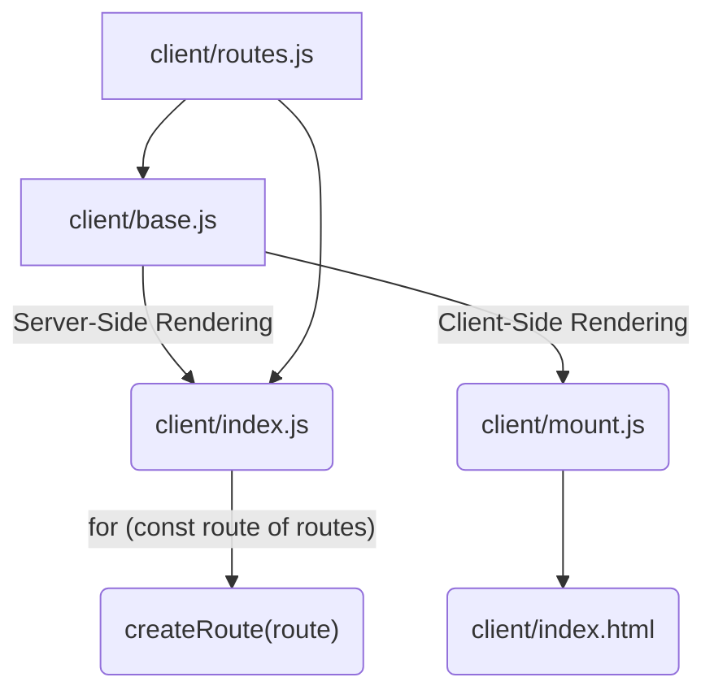

<!--@include: ./parts/links.md-->

<!--@include: ./parts/notice.md-->

# Router Integration

[react-router]: https://reactrouter.com/en/main
[vue-router]: https://router.vuejs.org/

There are a couple of problems with the setup in all the vanilla SSR examples, like the one examined in [**Rendering Function**](/guide/rendering-function). They are of course meant to be simple and educational in nature, not the basis for real world applications. First and more obvious, it's missing a client-side router like [React Router][react-router] or [Vue Router][vue-router], so you can only really render a single route.

The **[vue-hydration][vue-hydration]** is an educational example that illustrates how **`@fastify/vite`** can help integrating your client-side router to your backend. To be specific, it allows you to register an individual **Fastify** route for each of your client-side routes (i.e., the ones defined in **Vue Router**). This is useful because you're able to, among other things, register route hooks and even additional routes based on route metadata exported from your client module.

Let's start by examining the server file below. The first thing to notice is that `dev` is not set in the **`@fastify/vite`** plugin options. That's because the check for the `--dev` flag is actually the default behavior of **`@fastify/vite`**. You can use the `dev` flag if you need to use an environment variable to do set it, for instance, but if you just use `--dev` then it doesn't need to be set at all.

::: code-group
```js [server.js]
import Fastify from 'fastify'
import FastifyVite from '@fastify/vite'
import renderer from './renderer.js'

const server = Fastify({
  logger: {
    transport: {
      target: '@fastify/one-line-logger',
    },
  },
})

await server.register(FastifyVite, {
  root: import.meta.dirname,
  renderer,
})

await server.vite.ready()
await server.listen({ port: 3000 })
```
:::

Secondly, there's only one option set other than `root`, and that is [`renderer`](/config/#renderer). This is a convenience wrapper object to nearly all configuration options (except `root`, `dev`, `spa` and `renderer` itself), so you can package `@fastify/vite` configurations as packages, as is the case for the `@fastify/vue` and `@fastify/react` core renderer packages.

In this setup, we're leveraging [`createRoute()`](/config/#createroute) and [`createRenderFunction()`](/config/#createrenderfunction) to customize the way routes are registered and to define a rendering function that embeds server-side data on the final HTML document so it can part of the **hydration** process on the client.

::: code-group
```js [renderer.js]
import { renderToString } from '@vue/server-renderer'
import { uneval } from 'devalue'

export default { createRenderFunction, createRoute }

async function foobarHook (req) {
  req.server.log.info(`Hello from ${req.url} and foobarHook`)
}

function createRoute ({ handler, errorHandler, route }, scope, config) {
  scope.route({
    url: route.path,
    method: 'GET',
    handler,
    errorHandler,
    ...route.addFoobarHook && {
      onRequest: foobarHook,
    }
  })
}

function createRenderFunction ({ createApp }) {
  return async function (server, req, reply) {
    const data = { todoList: ['Do laundry', 'Respond to emails', 'Write report'] }
    const app = await createApp({ data, server, req, reply }, req.raw.url)
    const element = await renderToString(app.instance, app.ctx)
    return {
      element,
      hydration: `<script>window.hydration = ${uneval({ data })}</script>`
    }
  }
}
```
```js [client/routes.js]
export default [
  {
    path: '/',
    component: () => import('./views/index.vue'),
    addFoobarHook: true,
  },
  {
    path: '/other',
    component: () => import('./views/other.vue')
  }
]
```
```js [client/index.js]
import { createApp } from './base.js'
import routes from './routes.js'

export default {
  // Provides client-side navigation routes to server
  routes,
  // Provides function needed to perform SSR
  createApp
}
```
```html [client/index.html]
<!DOCTYPE html>
<!-- hydration -->
<div id="root"><!-- element --></div>
<script type="module" src="/mount.js"></script>
:::

The key thing to understand in this example is that **`@fastify/vite`** automatically executes [`createRoute()`](/config/#createroute) **for each of the routes defined** in the **`routes`** key from your client module default export.

As long as each object in the `routes` array (or function returning an array) has a `path` property, **`@fastify/vite`** will use it to register an individual Fastify route for your client-side route, by default. By providing your own [`createRoute()`](/config/#createroute) definition, you can customize it however you want. In this example, `client/routes.js` is shared by `client/base.js` and `client/index.js`, which *also* imports `client/base.js`.



Notice how `addFoobarHook` is a flag set in one of the client-side routes (in `client/routes.js`), just to demonstrante how it can be used to customize route registration, in this case setting `foobarHook` as an [`onRequest`](https://fastify.dev/docs/latest/Reference/Hooks/#onrequest) hook.

To understand the **hydration** aspect of this example, notice how `data` is passed to `createApp()` for SSR in server-side rendering function, but also made available on the client for the client-side hydration phase (in `client/mount.js`) via `window.hydration`. Variations of this very same pattern are what **Next.js**, **Nuxt.js** and many other SSR frameworks actually use to power client-side hydration when data was prefetched on the server.

You don't need to really dive into `client/base.js` or `client/base.vue` to understand the general mechanics of this, and also to realize that it will be the same for every framework you use — see the [react-hydration][react-hydration] example and compare it to this example for reference. You'll see the only real differences are in the Vue and React code (and SSR methods used from each framework).

Fully understanding the [vue-hydration][vue-hydration] and [react-hydration][react-hydration] examples should pave the way for you to understand more advanced examples like [vue-next][vue-next] and [react-next][vue-next], which still more educational than actually usable foundations for real world applications, and also the core renderers [`@fastify/vue`][fastify-vue] and [`@fastify/react`][fastify-react] which are actually provided as full-blown foundations for [**Nuxt.js**][nuxt] and [**Next.js**][next]-like applications.
