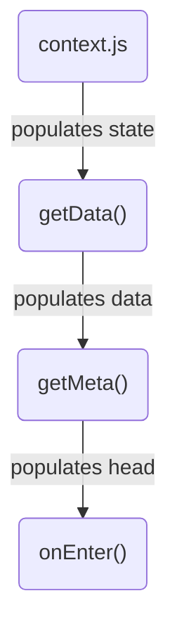

<!--@include: ../guide/parts/links.md-->

# Route Context

In **`@fastify/react`** applications, the **route context** is an object available in every [**route module**](/react/route-modules) and [**layout module**](/react/route-layouts). It is populated via the [**route context initialization module**](/react/route-context#init-module), and accessed via the `useRouteContext()` hook.

This route context implementation is extremely simple and deliberately limited to essential features. Its goal is to be easy to understand, extend or completely modify if needed. Note that some aspects of this implementation are tightly coupled to the server. In **`@fastify/react`**'s source code, you can see the implementation of [`server/context.js`](https://github.com/fastify/fastify-vite/blob/dev/packages/fastify-react/server/context.js) and [its use in `createRoute()`](https://github.com/fastify/fastify-vite/blob/dev/packages/fastify-react/index.js) that first populates the route context object on the server and prepares it for hydration.

Replacing the default route context implementation with your own would require you to also provide your own `createRoute()` implementation, based on the original one. In this case, instead of passing `@fastify/react` to the `renderer` plugin option from `@fastify/vite`, you would first import it so you can easily extend it. This is an example of the depth of extensibility of `@fastify/react`.

```js
import Fastify from 'fastify'
import FastifyVite from '@fastify/vite'
import FastifyReact from '@fastify/react'

const server = Fastify()
await server.register(FastifyVite, {
  root: import.meta.dirname,
  renderer: {
    ...FastifyReact,
    createRoute() {
      // Your custom create Route implementation
    },
  },
})
```

## Init module

`@fastify/react` projects can have a special `context.js` file, which is used to populate the **route context**. The way it populates it is by first running its default export, which is expected to be a function, and if there's a `state()` function export, also running it and populating the **global state**. With the exception of the `default` export and the `state` named export, all other named exports from this file are added to the **route context** as-is.

> If you're familiar with [Nuxt.js](https://nuxtjs.org/), you can think of `context.js` as a [Nuxt.js plugin](https://nuxtjs.org/docs/directory-structure/plugins/), in the way it **runs twice**, once on the server before SSR, and another on the client during the hydration phase. And also because it can be used to make dependencies available to all route modules and initializes the **global state**.

The `client/context.js` file you see below is taken from the [`react-kitchensink`](https://github.com/fastify/fastify-vite/tree/dev/starters/react-kitchensink) starter template, which includes everything from [`react-base`](https://github.com/fastify/fastify-vite/tree/dev/starters/react-base) plus a few example pages demonstrating all of **`@fastify/react`**'s features.

Make sure to see the page examples in the other snippet tabs:

::: code-group

```js [client/context.js]
// Thin layer on top of fetch()
// to automatically perform JSON requests
import { sendJSON } from '/fetch.js'

// The default export function runs exactly once on
// the server and once on the client during the
// first render, that is, it's not executed again
// in subsquent client-side navigation via React Router.
export default (ctx) => {
  if (ctx.server) {
    ctx.state.todoList = ctx.server.db.todoList
  }
}

// State initializer, must be a function called state
// as this is a special context.js export and needs
// special processing, e.g., serialization and hydration
export function state() {
  return {
    user: {
      authenticated: false,
    },
    todoList: null,
  }
}

// Grouped actions that operate on the state. This export
// could be named anything, no special processing involved.
export const actions = {
  authenticate(state) {
    state.user.authenticated = true
  },
  todoList: {
    async add(state, item) {
      await sendJSON('/api/todo/items', { method: 'put', json: item })
      state.todoList.push(item)
    },
    async remove(state, index) {
      await sendJSON('/api/todo/items', { method: 'delete', json: index })
      state.todoList.splice(index, 1)
    },
  },
}
```

```jsx [client/pages/using-data.jsx]
import { useState } from 'react'
import { Link } from 'react-router'
import { useRouteContext } from '@fastify/react/client'

export function getMeta() {
  return { title: 'Todo List — Using Data' }
}

export function getData({ server }) {
  return {
    todoList: server.db.todoList,
  }
}

export default function Index(props) {
  const { data } = useRouteContext()
  const [todoList, updateTodoList] = useState(data.todoList)
  const [input, setInput] = useState(null)
  const addItem = (value) => {
    updateTodoList((list) => [...list, value])
    input.value = ''
  }
  return (
    <>
      <h2>Todo List — Using Data</h2>
      <ul>
        {todoList.map((item, i) => {
          return <li key={`item-${i}`}>{item}</li>
        })}
      </ul>
      <div>
        <input ref={setInput} />
        <button onClick={() => addItem(input.value)}>Add</button>
      </div>
      <p>
        <Link to="/">Go back to the index</Link>
      </p>
      <p>⁂</p>
      <p>
        When you navigate away from this route, any additions to the to-do list will be lost,
        because they're bound to this route component only.
      </p>
      <p>
        See the <Link to="/using-store">/using-store</Link> example to learn how to use the
        application global state for it.
      </p>
    </>
  )
}
```

```jsx [client/pages/using-store.jsx]
import { useState } from 'react'
import { Link } from 'react-router'
import { useRouteContext } from '@fastify/react/client'

export function getMeta() {
  return { title: 'Todo List — Using Store' }
}

export default function Index(props) {
  const { snapshot, state, actions } = useRouteContext()
  const [input, setInput] = useState(null)
  const addItem = async (value) => {
    await actions.todoList.add(state, value)
    input.value = ''
  }
  return (
    <>
      <h2>Todo List — Using Store</h2>
      <ul>
        {snapshot.todoList.map((item, i) => {
          return <li key={`item-${i}`}>{item}</li>
        })}
      </ul>
      <div>
        <input ref={setInput} />
        <button onClick={() => addItem(input.value)}>Add</button>
      </div>
      <p>
        <Link to="/">Go back to the index</Link>
      </p>
      <p>⁂</p>
      <p>
        When you navigate away from this route, any additions to the to-do list are not lost,
        because they're bound to the global application state.
      </p>
    </>
  )
}
```

:::

## Access hook

As shown in the snippets above, the **route context** is accessed via the **`useRouteContext()`** hook, available via the `@fastfiy/react/client` module.

> Contrary to all other [virtual modules](https://github.com/fastify/fastify-vite/blob/main/docs/config/react/virtual-modules.md), which are available via the `$app` prefix, the `useRouteContext()` hook is provided by `@fastify/react/client`. This file is responsible for defining the route context, the Valtio state and also provides a couple of helpers. It's the only part of the setup you're encouraged to avoid changing. But in highly customized setups, you could still provide your own `useRouteContext()` from a local module.

```js
import { useRouteContext } from '@fastify/react/client'

export default function Index (props) {
  const { ... } = useRouteContext()
  // ...
```

This hook can be used in any React component to retrieve a reference to the current route context. By default, it includes the following properties:

<table>
<thead>
<tr>
<th>Export</th>
<th>Description</th>
</tr>
</thead>
<tbody>
<tr>
<td>

`state`

</td>
<td>

Automatically populated by the **route context** initialization module.

On the client, this becomes a [valtio](https://github.com/pmndrs/valtio) object.

</td>
</tr>
<tr>
<td>

`data`

</td>
<td>

Automatically populated by the `getData()` function.

Covered in [Data fetching](/react/route-modules#data-fetching).

</td>
</tr>
<tr>
<td>

`head`

</td>
<td>

Universal page metadata function, covered in [Page metadata](/react/route-modules#page-metadata).

</td>
</tr>
<tr>
<td>

`server`

</td>
<td>

Reference to the Fastify server. Available only during SSR.

</td>
</tr>
<tr>
<td>

`clientOnly`

</td>
<td>

Value of the current route module's `clientOnly` export.

</td>
</tr>
<tr>
<td>

`serverOnly`

</td>
<td>

Disables cleint-side rendering (ships static markup).

</td>
</tr>
<tr>
<td>

`streaming`

</td>
<td>

Enables **streaming** server-side rendering.

</td>
</tr>
</tbody>
</table>

## Execution order

This graph illustrates the hook execution order, from [**route context initialization**](/react/route-context#init-module) to the **route module** `getData()`, `getMeta()` and `onEnter()` exports.



First the `default` function export from `context.js` (if present) is executed. This is where you can manually feed global server data into your application by populating the global state (the route context's `state` property), which is automatically hydrated on the client.

Then `getData()` runs — which populates the route context's `data` property, and is also automatically hydrated on the client. Then `getMeta()`, which populates the route context's `head` property.

Then `onEnter()` runs and finally your route component renders.
