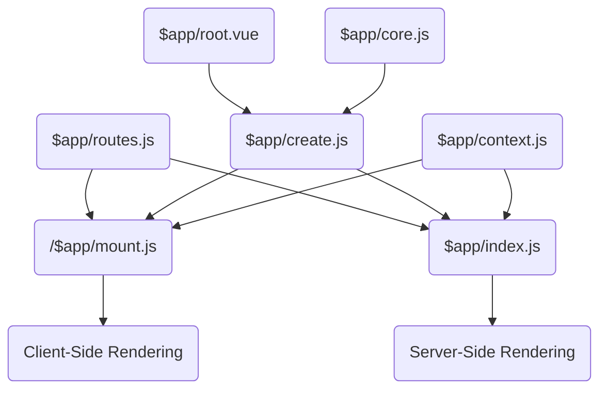

<!--@include: ../guide/parts/links.md-->

# Project Structure

A conscious effort was made to make `@fastify/vue` applications feel familiar to users of **Nuxt.js** and **Next.js**, especially on the matter of [route registration](/vue/router-setup).

A minimal **`@fastify/vue`** project may look like the following:

```text
├── server.js
├── client/
│    ├── index.js
│    ├── index.html
│    └── pages/
│          └── index.vue
├── vite.config.js
└── package.json
```

There are of course many other boilerplate files that comprise the setup, but they don't need to exist in your project directory for your application to run.

If they do exist, they override the defaults. This is made possible via [smart imports](/vue/project-structure#smart-imports), covered later in this document. It is a clean and straightforward way to avoid a massive number of boilerplate files for projects who do well with the defaults, while still easily allowing for customization and extensibility.

## Essential files

A `@fastify/vue` project must have at the very least:

<table>
<thead>
<tr>
<th>Export</th>
<th>Description</th>
</tr>
</thead>
<tbody>
<tr>
<td>

`server.js`

</td>
<td>

A Fastify server file that registers `@fastify/vite`.

</td>
</tr>
<tr>
<td>

`vite.config.js`

</td>
<td>

Your Vite application configuration. file

It needs to import and register `@fastify/vue/plugin`.

</td>
</tr>
<tr>
<td>

`client/index.js`

</td>
<td>

The Vite application module loaded by `@fastify/vite`.

It must export an object with `create`, `routes` and `context`.

These are detailed further below on this page.

</td>
</tr>
<tr>
<td>

`client/index.html`

</td>
<td>

The Vite application HTML template:

```html
<!doctype html>
<html lang="en">
  <head>
    <meta charset="utf-8" />
    <meta name="viewport" content="width=device-width, initial-scale=1" />
  </head>
  <link rel="stylesheet" href="/base.css" />
  <div id="root"><!-- element --></div>
  <!-- hydration -->
  <script type="module" src="/$app/mount.js"></script>
</html>
```

It needs to have `element` and `hydration` placeholders.

The `<html>` and `<head>` tags are processed by [unhead](https://github.com/unjs/unhead).

And it must import `$app/mount.js` as the main module.

</td>
</tr>
<tr>
<td>

`client/pages/*.vue`

</td>
<td>

Your application's [route modules](/vue/route-modules).

If you don't have any, no client routes are rendered.

</td>
</tr>
</tbody>
</table>

Explore the main files in the various tabs of the snippet below:

::: code-group

```js [server.js]
import Fastify from 'fastify'
import FastifyVite from '@fastify/vite'

const server = Fastify({
  logger: {
    transport: {
      target: '@fastify/one-line-logger',
    },
  },
})

await server.register(FastifyVite, {
  root: import.meta.dirname,
  renderer: '@fastify/vue',
})

await server.vite.ready()
await server.listen({ port: 3000 })
```

```js [vite.config.js]
import { resolve } from 'node:path'

import viteVue from '@vitejs/plugin-vue'
import fastifyVue from '@fastify/vue/plugin'

export default {
  root: resolve(import.meta.dirname, 'client'),
  plugins: [viteVue(), fastifyVue()],
}
```

```js [client/index.js]
import routes from '$app/routes.js'
import create from '$app/create.js'

export default {
  context: import('$app/context.js'),
  routes,
  create,
}
```

```html [client/index.html]
<!DOCTYPE html>
<html>
  <head>
    <meta charset="utf-8" />
    <link rel="stylesheet" href="./base.css" />
    <!-- head -->
  </head>
  <body>
    <div id="root"><!-- element --></div>
  </body>
  <!-- hydration -->
  <script type="module" src="/$app/mount.js"></script>
</html>
```

```vue [client/pages/index.vue]
<template>
  <h1>{{ message }}</h1>
  <p></p>
</template>

<script setup>
import logo from '/assets/logo.svg'

const message = 'Welcome to @fastify/vue!'
</script>

<script>
export function getMeta() {
  return {
    title: 'Welcome to @fastify/vue!',
  }
}
</script>

<style scoped>
img {
  width: 100%;
}
</style>
```

:::

[vue-base]: https://github.com/fastify/fastify-vite/tree/dev/starters/vue-base

This example is actually provided as the [vue-base][vue-base] starter.

In this example, `server.js` is the Fastify server and also the place where both `@fastify/vite` and `@fastify/vue` are imported to set up your application.

Like in any `@fastify/vite` application, `client/index.js` are the portions of your client code that get loaded by the server. It exports your application's factory function (`create`), the application routes and the [route context](/vue/route-context) initialization module, all loaded via [smart imports](/vue/project-structure#smart-imports), covered later on this page.

Notice that `client/index.html` needs to exist as the [front-and-central entry point](https://vitejs.dev/guide/#index-html-and-project-root) of your application, and `@fastify/vue` has its own structure for it.

Also notice that in `vite.config.js`, `@fastify/vue/plugin` needs to be registered so that [**smart imports**](/vue/project-structure#smart-imports) can work.

## Smart imports

What you saw above already is the minimal boilerplate for a fully functioning `@fastify/vue` application. As you can imagine though, there's a lot going on under the hood. What makes just placing files under `pages/` work to get them loaded as route modules? How is the application mounted on the client? Where is the hydration logic covered in the **`@fastify/vite`** examples?

The core files of **`@fastify/vue`** that make all of that (and a bit more) work don't have to exist in your project directory, but are loaded nonetheless:

```text {3-7,10-11}
├── server.js
├── client/
│    ├── core.js
│    ├── create.js
│    ├── mount.js
│    ├── routes.js
│    ├── router.vue
│    ├── root.vue
│    ├── context.js
│    ├── index.js
│    ├── index.html
│    ├── layouts/
│    │    └── default.vue
│    └── pages/
│          └── index.vue
├── vite.config.js
└── package.json
```

<div style="font-size: 1.2em !important">

The way this works is via the `$app/` prefix.

</div>

Notice how `client/index.html` imports the Vue application mounting script from `$app/mount.js`, and `client/index.js` loads routes from `$app/routes.js`, the application factory function from `$app/create.js` and the [route context](/vue/route-context) initialization module from `$app/context.js`.

What this prefix does is **first check if the file exists** in your Vite project root directory, **and if not**, provide the **default versions** stored inside the `@fastify/vue` package instead.

Below is a quick rundown of all smart imports available.

<table>
<thead>
<tr>
<th>Smart import</th>
<th>Description</th>
</tr>
</thead>
<tbody>
<tr>
<td>

`$app/core.js`

</td>
<td>

This is used by `$app/create.js` internally to create your Vue application instance, but it's also the location where to import the [`useRouteContext()`](/vue/route-context) hook from.

It also exports the `isServer` convenience flag.

</td>
</tr>
<tr>
<td>

`$app/create.js`

</td>
<td>

Where your Vue application factory function is exported from. It must be named `create` — or `client/index.js` and `client/mount.js` need to be changed accordingly.

</td>
</tr>
<tr>
<td>

`$app/mount.js`

</td>
<td>

The Vite application mount script, imported by `index.html`.

</td>
</tr>
<tr>
<td>

`$app/router.vue`

</td>
<td>

The main Vue Router component for your application.

Loaded by `$app/root.vue`.

</td>
</tr>
<tr>
<td>

`$app/root.vue`

</td>
<td>

The main Vue component for your application.

It can also export a `configure({ app, router })` function to let you further extend the Vue and Vue Router instances without having to fully eject other core virtual modules into your application.

</td>
</tr>
<tr>
<td>

`$app/context.js`

</td>
<td>

The [route context](/vue/route-context) initialization file.

</td>
</tr>
<tr>
<td>

`$app/layouts/default.vue`

</td>
<td>

The default route [layout component](/vue/route-layouts).

</td>
</tr>
</tbody>
</table>

> They are covered in more detail with the contents of the actual default files in the [Virtual Modules](/config/vue/virtual-modules) section of the [Configuration](/config/) section.

The graph below indicates the relationships between them:



## Special directories

Even though this is implied in previous references in the documentation, for completeness sake, below is a list of all the special directories in **`@fastify/vue`** applications that are processed differently and in an automated fashion.

<table>
<thead>
<tr>
<th>Special directory</th>
<th>Description</th>
</tr>
</thead>
<tbody>
<tr>
<td>

`/pages`

</td>
<td>

Default [route module search location](/vue/router-setup).

</td>
</tr>
<tr>
<td>

`/layouts`

</td>
<td>

Files are made available as route [layout components](/vue/route-layouts).

</td>
</tr>
</tbody>
</table>
